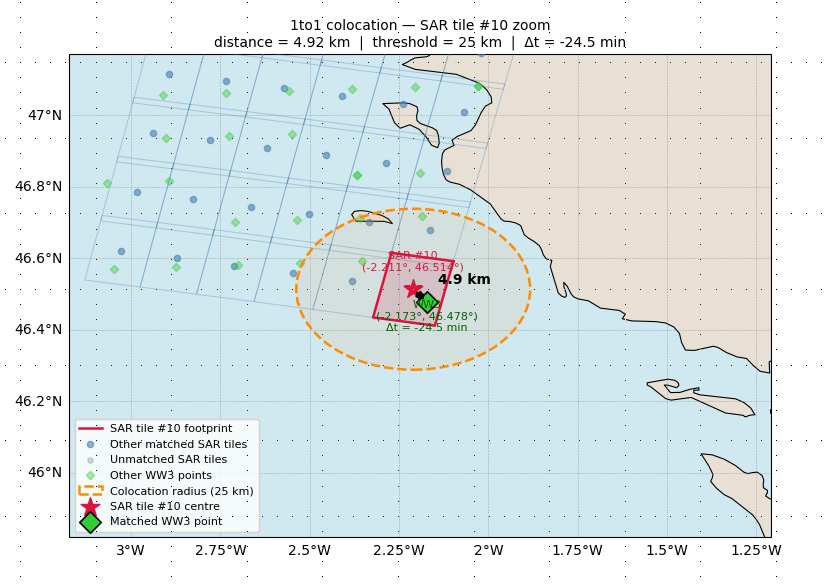

.. topsocnww3sp documentation master file

TOPSOCNWW3SP Documentation
==========================

Welcome to the TOPSOCNWW3SP documentation. This project provides tools for colocalizing SAR and WW3 spectral data.

.. toctree::
   :maxdepth: 2
   :caption: Contents:

   usage
   install
   api
   l2c_definition
   l2c_output_usage
   colocation_notebook
   l2c_processor_strategy

Indices and tables
==================

* :ref:`genindex`
* :ref:`modindex`
* :ref:`search`
